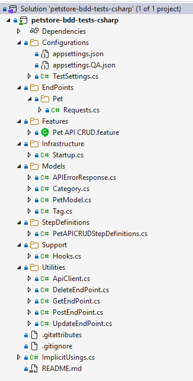

# 🧪 Petstore API Test Automation (C#)

## 📌 Overview

This project demonstrates end-to-end API test automation for the Swagger Petstore using **C#**, covering the full **CRUD (Create, Read, Update, Delete)** lifecycle.

The framework is designed with clean architecture principles and modern test automation practices, utilising **BDD (Behavior-Driven Development)** to validate business flows.

---

## 🚀 Tech Stack

* **C# (.NET)**
* **Reqnroll** – BDD framework for writing human-readable test scenarios
* **RestSharp** – HTTP client for API interaction
 **Newtonsoft.Json** – JSON serialization/deserialization
* **NUnit** - Test framework for test management
* **Shouldly** - Assertion library for fluent assertions

---

## 🧱 Framework Design & Patterns

This solution demonstrates the use of several key software design principles:

### ✔️ Dependency Injection (DI)

* Promotes loose coupling and testability
* API clients and dependencies are injected into step definitions

### ✔️ Singleton Pattern

* Ensures a single instance of the `RestClient` is reused across tests
* Improves performance and resource management

### ✔️ Generic Methods

* Reusable deserialization and response handling
* Reduces duplication and improves maintainability

### ✔️ Separation of Concerns

* Clear distinction between:

  * Step Definitions (test logic)
  * API Client (HTTP operations)
  * Models (data representation)
  * Helpers/Utilities

---

## 🧪 Test Coverage

The following CRUD operations are automated for the Pet endpoint:

* **Create Pet** – Add a new pet to the store
* **Get Pet** – Retrieve pet details by ID
* **Update Pet** – Modify existing pet details
* **Delete Pet** – Remove a pet from the store
* **Validation** – Confirm deletion and error handling

---

## 📂 Project Structure

```
├── Features/              # Gherkin feature files (BDD scenarios)
├── StepDefinitions/       # Step implementations
├── Configurations/        # Test settings and configurations
├── Models/                # Request/Response models
├── Utilities/             # Utilities (serialization, validation, etc.)
├── Hooks/                 # Test setup and teardown
└── README.md
```


---

## 🧩 Sample Scenario (BDD)

```gherkin
Feature: Pet API CRUD

Automated CRUD API tests for the Swagger Petstore using C#

Scenario: Create, Read, Update and Delete a pet
	When I create a new pet with the following details:
		| Id  | Name   | Photourls                     | Status    |
		| 123 | Fluffy | test.jpg, end-to-end test.png | available |
	Then the pet should be created successfully
	When I retrieve the pet by its ID 123
	Then the pet should exist

	When I update the below pet with the following details:
		| Id  | Name   | Photourls                     | Status    |
		| 123 | UpdatedFluffy | test.jpg, end-to-end test.png | available |
	Then the pet should be updated

	When I delete the pet with ID 123
	Then the pet should not exist
```

---

## ▶️ How to Run the Tests

1. Clone the repository:

   ```bash
   git clone https://github.com/yallav/petstore-bdd-tests-csharp.git
   ```

2. Navigate to the project directory:

   ```bash
   cd petstore-api-tests-csharp
   ```
3. Run tests:

   ```bash
   dotnet test
   ```
---

## 🧠 Key Highlights

* Clean and maintainable test automation framework
* Demonstrates real-world API testing practices
* Uses BDD for improved readability and collaboration
* Scalable design for adding more endpoints and scenarios

---

## 📬 Notes

This project is part of a technical assessment to demonstrate:

* Understanding of API testing principles
* Ability to design scalable automation frameworks
* Writing clean, maintainable, and production-ready C# code

---

## 👤 Author

[Vijay Yalla]

---
